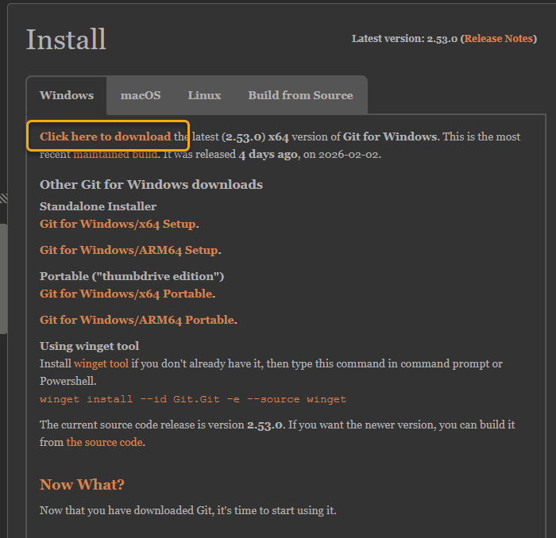
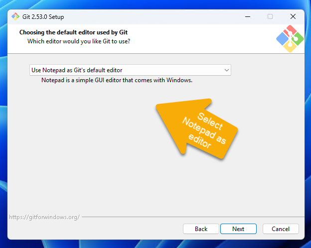
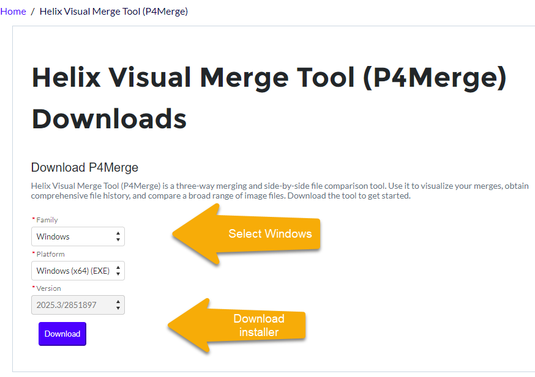
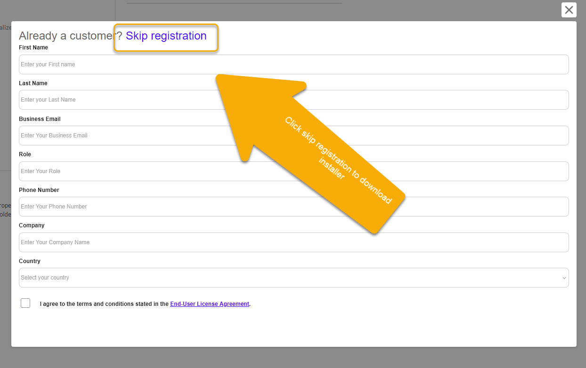
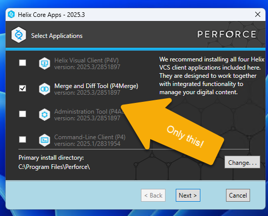
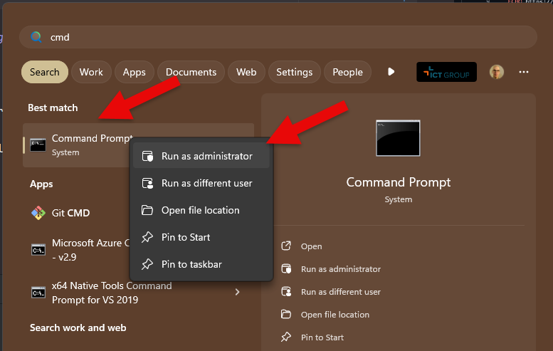

**Installing tooling for the Git training**

To follow the training, Git and supporting tooling needs to be installed and configured on your system. Please do this before attending the training.  

**Download Git for Windows**

[Download link](https://git-scm.com/install/windows)



Start the installer, use the defaults for everything *except* the editor. Set this to Notepad.



**Download P4Merge**

[Download link](https://portal.perforce.com/s/downloads?product=Helix%20Visual%20Merge%20Tool%20%28P4Merge%29)

Select the Windows version and click on download.



Select 'skip registration' to start the download.



Start the installer, and only select the merge/diff tool.




**Configuring Git**

We now need to configure Git to use P4Merge as a mergetool.

* Open an elevated command prompt (cmd.exe, run as administrator).
 

* Copy and paste each following line in the command prompt and execute each line. There should be a 'copy clipboard' button after each line for your convenience.

```
git config --global merge.tool p4merge
```

```
git config --global diff.tool p4merge
```

```
git config --global mergetool.keepBackup false
```

```
git config --global difftool.prompt false
```

```
git config --global user.email replace.with@your.email
```

```
git config --global user.name "Place your name here"
```

```
git config --global mergetool.p4merge.path "C:/Program Files/Perforce/p4merge.exe"
```