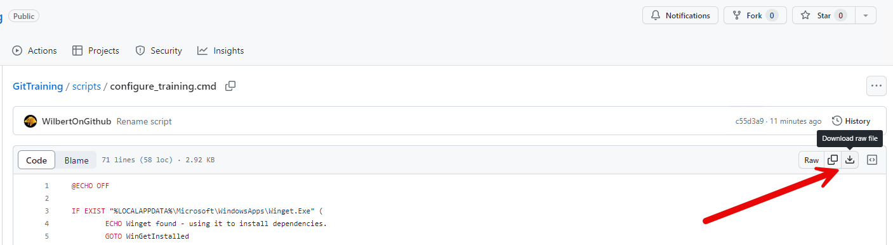
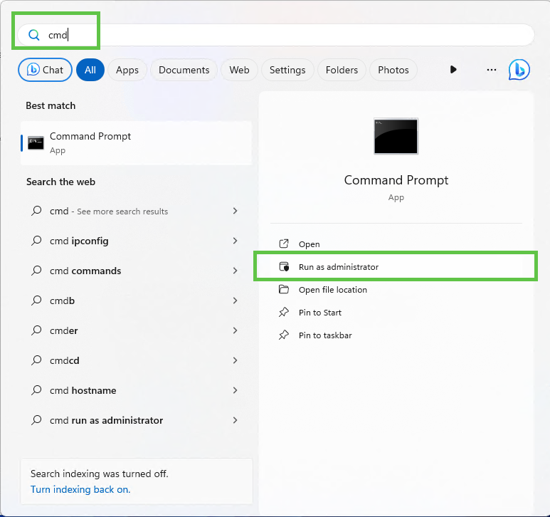
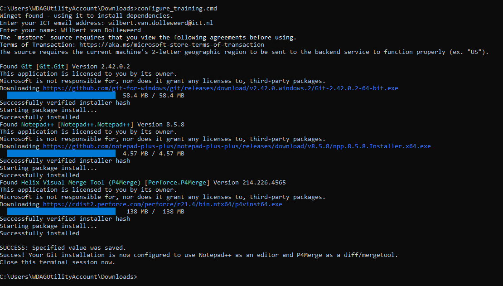

**Installing necessary tooling for the Git training**

To follow the training, Git and supporting tooling needs to be installed on your system. Please do this before attending the training.  
I've created a script that will do the following: 

* Ask for your name and email address
* Download and install Git for Windows / Notepad++ / Performce Merge Tool
* Use these to configure Git
* Add Git to your PATH environment variable

**How to run the script:**

* The script can be downloaded from this repository using the [following page](https://github.com/WilbertOnGithub/GitTraining/blob/master/scripts/configure_training.cmd). Use the "Raw" button to download the script. Windows might harm that this could be a harmful file, simply override the warning. 

* Open an elevated command prompt and go to the folder where the script is stored. 

* Run the script by typing `configure_training.cmd` and press enter. 

Done! You can close the command prompt.  

Are these instructions unclear? Please contact me at wilbert.van.dolleweerd@ict.nl with any questions you might have.

