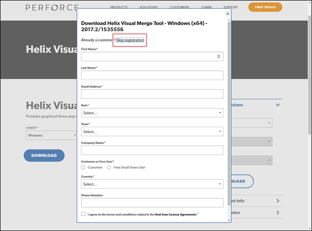
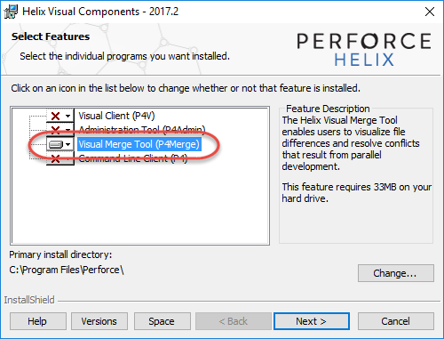

****How to install and configure Git for Windows****

These are the instructions on how to download, install and configure Git and associated tooling.

First of all, you need to download the following software:

* [Git for Windows](https://git-scm.com/download/win)

  Simply use the suggested defaults when installing.

* [Notepad++](https://notepad-plus-plus.org/download) for use as an editor
* [Perforce Merge Tool](https://www.perforce.com/downloads/visual-merge-tool) as a diff and merge tool

  You have to select that you want to download a Windows version and if you want to use the 32- or 64-bits version. After that choice, indicate that you are an existing customer - that will start the download immediately. 

  
    
  When installing only select the merge tool as indicated in the screenshot below.

    

Now the tools have been downloaded they still need to be configured to work correctly in Git.

I've created a script that will do the following:

* Configure Notepad++ as the default editor in Git
* Configure P4Merge as the default diff/merge tool in Git.

The script assumes that the tools have been installed in their default directories. The script will indicate if it encounters any errors.

<a href="https://cdn.rawgit.com/WilbertOnGithub/GitTraining/b604b858/scripts/configure.cmd" download target="_blank">Please download and run the script now</a>

Finally, Git needs to know some user information. Please enter the following commands while using your own name and email address.

`git config --global user.name "Wilbert van Dolleweerd"`

`git config --global user.email wilbert.van.dolleweerd@ict.nl`

Done! You now have a version of Git for Windows which is configured with the correct tooling.

Are these instructions unclear? Since the instructions are in a Git repository, I accept pull requests! You can contact me at wilbert@arentheym.com.

