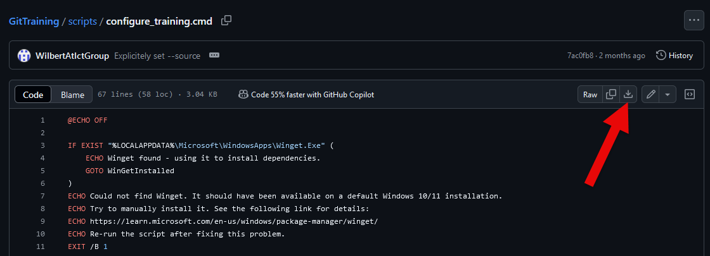
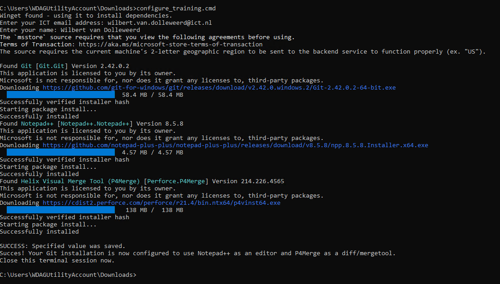

**Installing necessary tooling for the Git training**

To follow the training, Git and supporting tooling needs to be installed and configured on your system. Please do this before attending the training.  

I've created a script that will do this for you. The script will: 

* Ask for your name and email address
* Download and install Git for Windows, Notepad++ and the Perforce Merge Tool
* Configure Git
* Add Git to your PATH environment variable

You can study the script to see that it does nothing malicious.

**How to run the script:**

* The script can be downloaded [here](https://github.com/WilbertOnGithub/GitTraining/blob/master/scripts/configure_training.cmd).  
  Click on the 'download raw' button to download the script. Windows might warn that this could be a harmful file, simply override the warning.
  

* Open an elevated command prompt (cmd.exe, run as administrator) and go to the folder where the script is stored. This will probably be your downloads folder.
  

* Run the script by typing `configure_training.cmd` and press enter. 

Done! You can close the command prompt.  

Are these instructions unclear? Please contact me at wilbert.van.dolleweerd@ict.nl with any questions you might have.